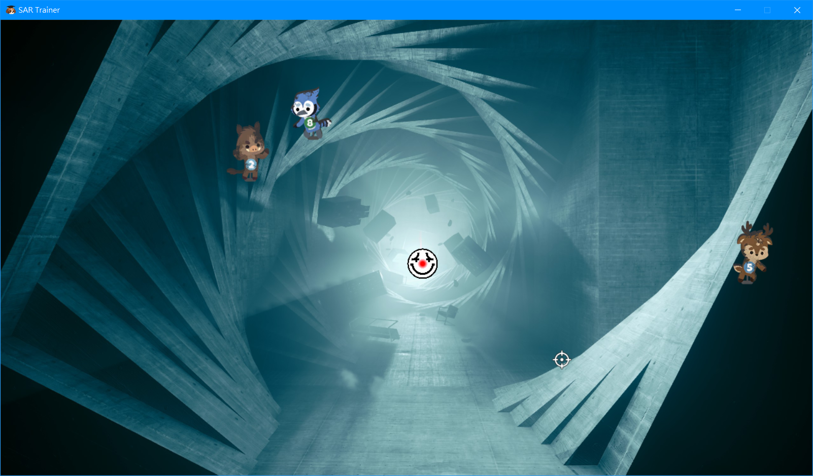

# SAR-Trainer

SAR simulator for practicing aiming &amp; shooting

Default weapon: Magnum

Note: I DO NOT own the artworks / audios used in this project

## Demo

## Configuration

There are some options can be configurated in [config.py](./config.py)

Like: 

* Window size
* Volume
* Images of player, cursor, background and enemies
* Maximum enemy amount per time.

## Planned

I divided them into different categories

### UI

* [ ] Add status display on top-left corner (Fired bullets amount, kills, hit rate)

### Player

* [ ] Better moving speed
* [ ] Fix character in the middle when moving around

### Enemies

* [ ] Better spawning mechanism
* [ ] Make enemy moves

### Weapons

* [ ] Better bullet speed
* [ ] Add recoil
* [ ] Add reload to weapons
* [ ] Add more weapons
* [ ] Add full-auto weapons
* [ ] Add cooldown on specific wepaons (E.g: Magnum)

### Ultimate goal

* [ ] Re-create this in Unity / C#